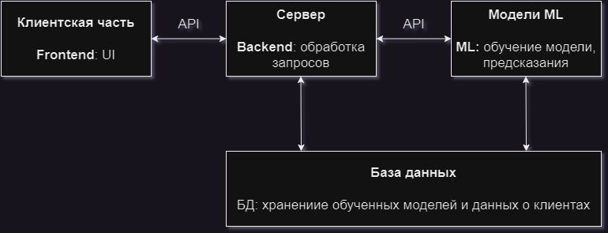

# TermDepositClassificationService

## Задача:
**Реализовать сервис прогнозирования вероятности того, оформления  ли срочный депозит клиент банка на основе банковских данных о нем**

## Обзор ML части:
1. в ```./utils/ml_api.py``` реализовано API для взаимодействия с модулем машинного обучения.
    - Метод ```get_predict(df, filename)```, где ```df``` – это ```pd.DataFrame```, ```filename``` – это название модели. Метод возвращает кортеж из ```precision, recall, f1-score``` значений и формирует файл ```result_example.csv```, который необходим для дашборда.
    - Метод ```feature_construct(path)```, где path - это путь к файлу, для которого необходимо сконструировать фичи. 
3. готовые датасеты лежат в папке ```./data```.
    - для теста будем использовать ```test.csv```
    - для обучения модели заранее подготовлен ```train.csv```
    - сырой датасет ```bank-additional-full.csv```
5. обученные модели лежат в папке ```./models```
## Интерпретация "result_example.csv":
1. ```result_example.csv``` – это пример файла, который формируется при вызове метода ```get_predict(...)```.
2. файл содержит значения вероятности того, что , клиент оформит срочный депозит.
3. в файле два столбца: ```0 и 1```. Нас интересует значения для ```1```.
    - ```0``` – не оформил срочный депоит
    - ```1``` – оформил срочный депозит

**Вид файла:**
| id |0  |1  |
| --- | --- | --- |
|20806  |0.99  |0.01  |
|32487  | 0.99 | 0.01 |
|6605  |0.49  |0.51  |
|...  | ...| ... |
|12415  |0.98  |0.02  |

## Примерное описание архитектуры:


1. **Frontend (Клиентская часть):**
    - Интерфейс пользователя (UI/UX): Веб-интерфейс, который предоставляет пользователю доступ к функциям приложения, включая отправку запросов на обработку данных машинными алгоритмами.
    - JavaScript или фреймворки фронтенда: Использование JavaScript и соответствующих фреймворков (например, React, Angular, Vue.js) для создания интерактивного пользовательского интерфейса.
    
2. **Backend (Серверная часть):**
    - Web-сервер: Принимает запросы от клиентской части, обрабатывает их и возвращает результаты.
    - Обработка запросов: Обработка запросов от клиентской части, включая запросы на машинное обучение.
    - API для машинного обучения: Модуль, обеспечивающий взаимодействие с обученными моделями машинного обучения. Он может обрабатывать запросы на предсказание, обучение моделей и т.д.
    - Облачные сервисы для хранения и обработки данных: Хранение данных, использование облачных ресурсов для обработки больших объемов информации при необходимости.
    
3. **Модели машинного обучения:**
    - Модуль обучения и предсказаний: Здесь находятся обученные модели машинного обучения и код для их использования для предсказаний на новых данных.
    
4. **База данных и хранение данных:**
    - База данных: Хранение данных приложения, таких как пользовательская информация, история запросов и результаты машинного обучения.


